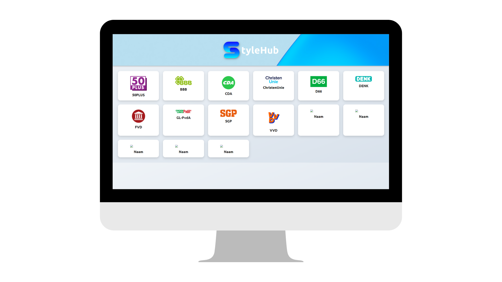
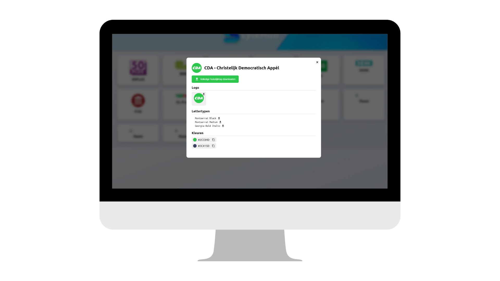

 
<b>StyleHub</b> is a web application that allows users to explore and compare the visual identities of all political parties in the Netherlands. From logos and color palettes to typography, StyleHub provides a centralized hub for understanding and analyzing party branding.

## Screenshots
<b>1 Homepage</b>

 
<b>2 Party style page<b>

